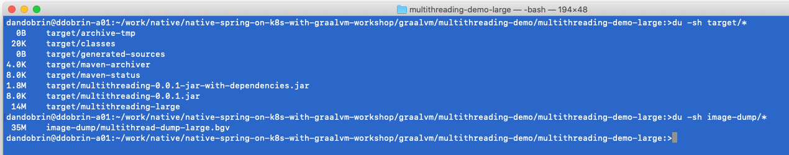
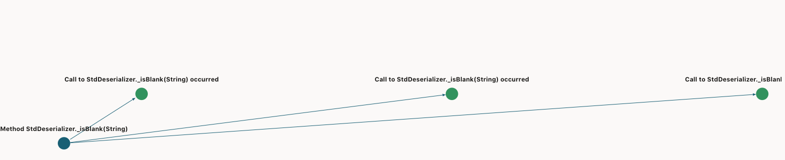

# Java Multithreading Demo for the GraalVM Dashboard

The Multithreading demo is provided to showcase the applicability of [GraalVM Dashboard](https://www.graalvm.org/docs/tools/dashboard/) - a web-based dashboard for visualizing arbitrary aspects of dynamic and static compilations in GraalVM, in particular, [Native Image](https://www.graalvm.org/reference-manual/native-image/).

Code: 
* The demo is a Java program which does synchronous and asynchronous thread execution.
* Each thread loops through exactly the same array of integers and generates a stream of pseudorandom numbers.
* The programs calculate the time taken to perform the task synchronously and asynchronously.

The Multithreading demo offers two sub-projects, each built with Maven: 
* Multithreading Demo Large 
* Multithreading Demo Improved.

## The GraalVM Dashboard

The Dashboard is a web-based visualization tool helping you make sense of collected information on methods compilation, 
reachability, class usability, profiling data, pre-initialized heap data and the static analysis results. 

You can monitor which classes, packages, and preinitialized objects fill up the executable, see how much space certain package occupies, 
and which classes objects take most of the heap. All this data is very helpful at understanding how to optimize the application further. 

The Dashboard is available [at this link](https://www.graalvm.org/docs/tools/dashboard/)


The dashboard offers three visualization formats:
* Code Size Breakdown — shows size of precompiled packages and classes 
* Heap Size Breakdown — shows which objects are on the pre-initialized heap
* Points-to Exploration — explores why certain classes and methods are included in the native image

The _pom.xml_ file of each sub-project includes the [Native Image Maven plugin](https://www.graalvm.org/reference-manual/native-image/NativeImageMavenPlugin/), which instructs Maven to generate a native image of a JAR file with `all dependencies` included at the `mvn package` build step.

The plugin will gather the diagnostic information during the native image build and write that data to a dump file in the target directory, 
while specifying the following two flags:
* -H:+DashboardAll - dump all available data
* -H:DashboardDump=../image-dump/multithread-dump-large - location of the dump file

**NOTE:** For an immediate assessment of the capabilities of the GraalVM Dashboard, pre-built dashboard data has been made available for both demos, in the `image-dump` subfolder.

```xml
<plugin>
    <groupId>org.graalvm.nativeimage</groupId>
    <artifactId>native-image-maven-plugin</artifactId>
    <version>${graalvm.version}</version>
    <executions>
        <execution>
            <goals>
                <goal>native-image</goal>
            </goals>
            <phase>package</phase>
        </execution>
    </executions>
    <configuration>
        <skip>false</skip>
        <imageName>multithreading-large</imageName>
        <buildArgs>
            <buildArg>--no-fallback</buildArg>
            <buildArg>--initialize-at-build-time</buildArg>
            <buildArg>-H:+DashboardAll</buildArg>
            <buildArg>-H:DashboardDump=../image-dump/multithread-dump-large</buildArg>
        </buildArgs>
        <mainClass>com.example.Multithreading</mainClass>
    </configuration>
</plugin>
```

## Multithreading Demo Large

1. Download or clone the repository and navigate into the _multithreading-demo/multithreading-demo-large_ directory:
```shell
> git clone git@github.com:ddobrin/native-spring-on-k8s-with-graalvm-workshop.git

> cd graalvm/multithreading-demo/multithreading-demo-large
```
2. Build the project:
```
# jvm build
> mvn clean package

# native image build
> mvn clean package -Pnative
```
3. Run the project on a JVM or as a native image:
```
> java -jar target/multithreading-0.0.1-jar-with-dependencies.jar

> ./target/multithreading-large
```

The build produces the dump file in BGV format. You can see the output pre-recorded for both samples in the `<project>/image-dump` folders.


We can run the app and observe the output:


Observe the size of the dump file and the archive:


We can now open the dashboard and select the file from the `target` subfolder (or open the one provided to you in the workshop).

#### Code Size Breakdown 
The Code Size Breakdown tool allows you to examine which precompiled code ends up inside the native image, and which Java packages contributed most to its size. 
Code Size Breakdown displays the breakdown by packages, classes and methods that were included into an image. 
Package sizes are proportional to the size in the native image. 

**Alternatively**: run `-H:+PrintUniverse` and observe the text output.


#### Heap Size Breakdown

Heap Size Breakdown presents a visual summary of the sizes of the pre-allocated objects of different classes, 
which were included into a native image heap. The pre-allocated objects are objects allocated in advance during a native image 
build and stored in the data section of the executable. At run time, they are loaded directly into memory.


Observe the application code occupying a tiny space marked in yellow on the right hand side of the image

#### Points-To Explorer 

The Points-to Explorer instrument allows exploring why a certain method was included into a native image, 
the sequence of calls to that method and whether we can avoid including this method possible in the future.



**Observations:**: the native image occupies 14MB of space, and the dump file is listed at 35 MB, quite large.
This is primarily due to Jackson files being added to the native image.

## Multithreading Demo Improved

Multithreading Demo Improved contains an enhanced version of the same program.

1. Download or clone the repository and navigate into the _multithreading-demo/multithreading-demo-improved_ directory:
```
> git clone git@github.com:ddobrin/native-spring-on-k8s-with-graalvm-workshop.git

> cd graalvm/multithreading-demo/multithreading-demo-improved
```
2. Build the project:
```
# jvm build
> mvn clean package

# native image build
> mvn clean package -Pnative
```
3. Run the project on a JVM or as a native image:
```
> java -jar target/multithreading-0.0.1-jar-with-dependencies.jar

> ./target/multithreading-improved
```

The build produces the dump file in BGV format. You can see the output pre-recorded for both samples in the `<project>/image-dump` folders.


Observe the size of the dump file and the archive:


We can now open the dashboard and select the file from the `target` subfolder (or open the one provided to you in the workshop).

**Observations:**: the native image, after improvements, occupies only 7.7MB of space, and the dump file is listed at 13 MB, quite large.
